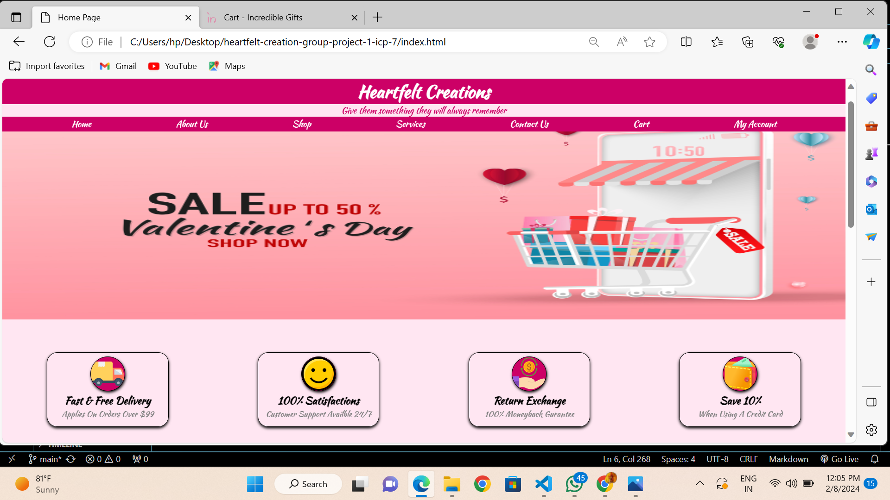

# Heartfelt Creations

Welcome to our Heartfelt Creations! 💝
Looking to make this Valentine's Day extra special? You're in the right place! Our customized gift store offers a unique selection of heartfelt gifts that are perfect for expressing your love and affection.
## About Us
We are passionate about helping you celebrate love and affection in the most personalized way possible. Our store specializes in creating unique, heartfelt gifts that are tailored to your loved one's preferences, ensuring a truly memorable Valentine's Day experience.

---

---
## How to Contribute
To contribute to a Valentine's Day special customized gift store on GitHub, you'll need to follow these general steps:
1.Fork the Repository: Go to the GitHub repository of the gift store project and click on the "Fork" button at the top right corner of the page. This will create a copy of the repository in your GitHub account.  
2.Clone the Repository: Once you have forked the repository, clone it to your local machine using Git.  
3.Create a New Branch: Before making any changes, create a new branch where you will implement your contributions. This helps keep your changes isolated from the main branch.   
4.Make Your Contributions: Now you can make your desired changes to the project. This could include adding new features, fixing bugs, improving documentation, or anything else that enhances the project.  
5.Commit Your Changes: Once you've made your changes, stage them for commit.  
6.Push Your Changes: After committing your changes, push them to your forked repository on GitHub.  
7.Create a Pull Request (PR): Once your changes are pushed to your forked repository, navigate to the GitHub page of your fork. GitHub will show a prompt to create a pull request from your new branch.   
8.Review and Merge: After creating the pull request, the project maintainers will review your changes. They may provide feedback or request modifications. Once everything looks good, they will merge your changes into the main repository. 
9.Sync Forked Repository: Periodically, you may want to sync your forked repository with the original repository to incorporate any changes made by others. You can do this by adding the original repository as a remote and pulling changes from it. 

**That's it! You've successfully contributed**
## Contributors

Made with [contrib.rocks](https://contrib.rocks).